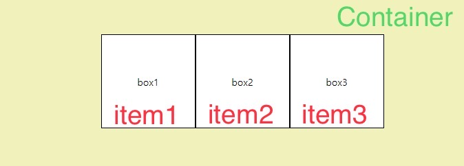
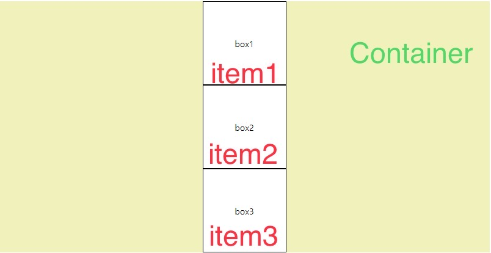

## Flex box 개념 재정의
- 목표: 지난번 정리한 flex-box를 이해한다.
- 각 요소가 컨테이너의 너비 공간의 크기를 정렬할 때 사용한다.
- Flex는 Container, items로 구성된다.
- Container: item을 감싸는 부모 요소로 `display, flex-flow, justify-content 속성을 가진다.`
- itmes: Container 자식 요소로 `order, flex, align-self 속성을 가진다.`

 

## Flex Container

 

### 🔎 display 속성 
- flex Container를 정의한다.

| 속성값 | 의미|
|-------|-----|
| flex | block 요소처럼 부모 요소를 수직으로 배치한다.
| inline-flex | inline 요소처럼 부모 요소를 수평으로 배치한다.

 

### 🔎 flex-direction 속성 

  
  

- 각 flex-box를 수평 정렬, 수직 정렬로 배치한 그림이다.
- [HTML: flex-box 코드](https://github.com/Seungeun727/WEBFRONT/blob/master/study/flexbox.html)
- [CSS: flex-box 코드](https://github.com/Seungeun727/WEBFRONT/blob/master/study/css/flex-box.css)

 

| 속성값 | 의미 |
| --- | --- |
| row | 행축(수평축) 방향 |
| row-reverse | 행축(수평축)의 역순 방향 |
| column | 열축(수직) 방향 |
| column-reverse | 열축(수직)의 역순 방향 |

 

### 🔎 `justify-content 속성(수평축 정렬)` 
| 속성값 | 의미 |
| --- | --- |
| flex-start | flex에 속하는 items 시작점으로 정렬한다. |
| flex-end | flex items 끝을 기준으로 정렬한다. |
| center | flex items 중간점 혹은 가운데로 정렬한다. |
| space-between | flex items 사이에 균일한 간격 지정한다. |
| space-around | flex items 둘레를 균일한 간격 지정한다.  |
| space-even | flex items 양 끝을 균일한 간격 지정한다.  |

 

### 🔎 flex-wrap 속성 
| 속성값 | 의미 |
| --- | --- |
| no-wrap | 묶음 없음(줄바꿈 없음) |
| wrap | 여러줄로 묶음(줄바꿈 있음) |
| wrap-reverse | 줄바꿈 처리하며 역순으로 배치한다. |

 

### ⭐⭐ align-items(수직축에서 items 정렬)
| 속성값 | 의미 |
| --- | --- |
| stretch | flex에 속하는 items 수직축 끝점까지 배치된다. |
| flex-start | flex-items 각 줄의 시작점으로 정렬한다. |
| flex-end | flex items 각 줄의 끝점 기준으로 정렬한다. |
| center | flex items 각 줄의 가운데로 정렬한다. |
| baseline | flex items 텍스트 기준으로 정렬한다. |

 

### ⭐⭐ align-content
- flex line을 정렬한다.

| 속성값 | 의미 |
| --- | --- |
| stretch | flex에 속하는 items 시작점으로 정렬한다. |
| flex-start | flex-items 시작점으로 정렬한다. |
| flex-end | flex items 끝을 기준으로 정렬한다. |
| center | flex items 중간점 혹은 가운데로 정렬한다. |

 

## 📌 참고
- 패스트 캠퍼스 인강 position 설명
- 이미지: 직접 작성한 예제